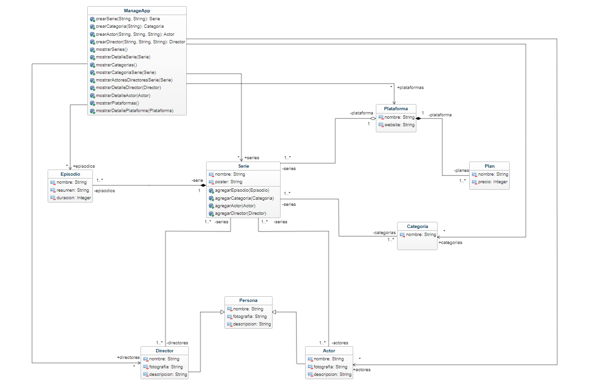

# TV Series

Aplicación para consultar información sobre diferentes series de televisión.

   

## Glosario de términos

### Entidades:

1. `Plataforma:` Representa una plataforma de transmisión de series. Contiene los siguientes atributos:

   + Nombre: Nombre de la plataforma.
   + Sitio web: Sitio web de la plataforma.
   + Planes y precios: Listado de planes y precios ofrecidos por la plataforma.

    

2. `Serie:` Representa una serie de televisión. Contiene los siguientes atributos:

   + Imagen: Imagen que representa visualmente la serie.
   + Nombre: Nombre de la serie.
   + Categorías: Conjunto de categorías a las que pertenece la serie (acción, drama, romance).

    
   
3. `Episodio:` Representa un episodio de la serie. Contiene los siguientes atributos:

   + Nombre: Nombre del episodio.
   + Resumen: Resumen del episodio.
   + Duración: Duración del episodio.

    

4. `Categoria:` Representa una categoría a la que puede pertenecer una serie. Contiene el siguiente atributo:

   + Nombre: Nombre de la categoría.

    

5. `Plan:` Representa un plan ofrecido por una plataforma. Contiene los siguientes atributos:

   + Nombre: Nombre del plan.
   + Precio: Precio del plan.

    

6. `Director:` Representa un director de la serie. Contiene los siguientes atributos:

   + Nombre: Nombre del director.
   + Fotografía: Imagen que muestra al director.
   + Descripción: Descripción del director.
   + Series dirigidas: Listado de series en las que ha dirigido.

    

7. `Actor:` Representa un actor de la serie. Contiene los siguientes atributos:

   + Nombre: Nombre del actor.
   + Fotografía: Imagen que muestra al actor.
   + Descripción: Descripción del actor.
   + Series en las que ha actuado: Listado de series en las que ha actuado.

    

### Relaciones:

---

+ **`Plataforma - Plan:`** Una plataforma ofrece varios planes. (Relación de "uno a muchos") Composición
+ `Plataforma - Serie:` Una plataforma puede ofrecer varias series. (Relación de "uno a muchos") Agregación
+ `Serie - Categoría:` Una serie puede pertenecer a varias categorías. (Relación de "muchos a muchos") Asociación
+ `Serie - Episodio:` Una serie está compuesta por varios episodios. (Relación de "uno a muchos") Composición
+ `Director - Serie:` Un director puede dirigir una o varias series, y una serie puede tener uno o varios directores. (Relación de "muchos a muchos") Agregación
+ `Actor - Serie:` Un actor puede actuar en una o varias series, y una serie puede tener uno o varios actores. (Relación de "muchos a muchos") Agregación

